# Marathon

First Python Script I created to automate a routine task.

## Overview

When a new Asset, Customer Account, or SWD is added, a manual process was done that took hours upon hours. Automating the process allows time to be spent on a less tedious task.

The Process to automate:

- Generate combinations of the new entries with all the existing entries
- Combinations requirements: The asset and swd must have the same district. i.e north or south. The Asset, SWD, and Customer Accounts must be for the Bakken Region
- For each combination, calculate the distance between the Asset and SWD
- Based on the distance calculated, assign a mileage band 
- Mileage band requirements: the asset well phase must equal the well phase of the mileage band
- Based on the mileage band and customer account, assign a unit rate
- Upload all finished combinations into the TMSMileageBands table

## Process

### Get the ID of the Bakken Region and the ID of Water Hauling

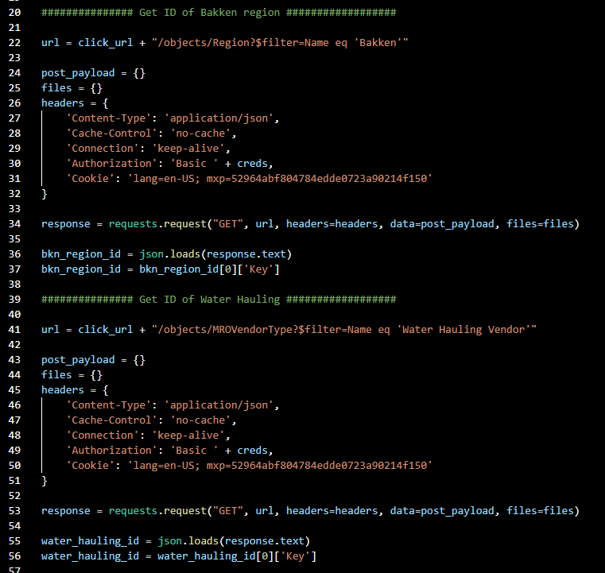

- The region will be used to obtain the correct Assets, Customer Accounts, and SWD
- The only Customer Accounts we are interested in are those that have the Water Hauling ID

### Gather Customer Account, Asset, and SWD Items

#### New Customer

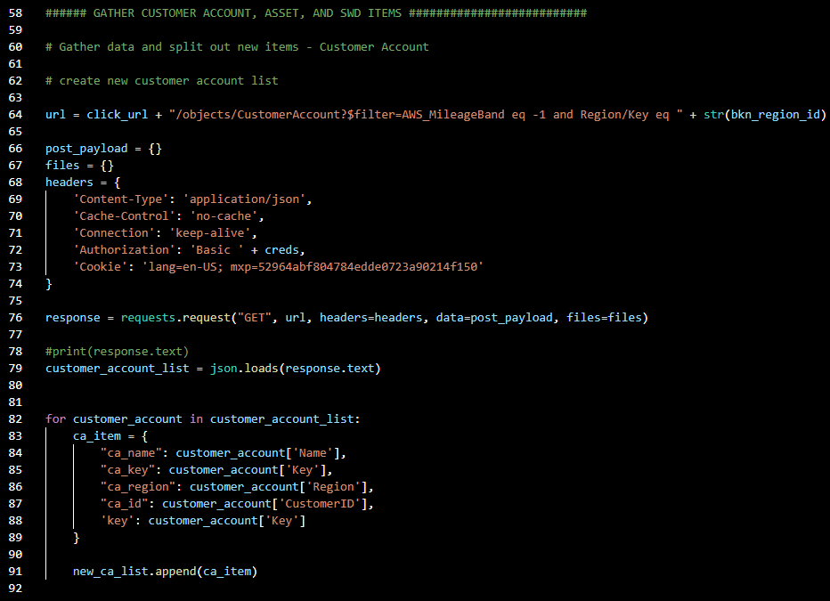

- Obtain information on any new Customer Accounts
- New Customer Accounts has a AWS_MileageBand flag equal to -1
- The same process is used to obtain the existing Customer Accounts with a AWS_MileageBand flag not equal to -1

#### New SWD

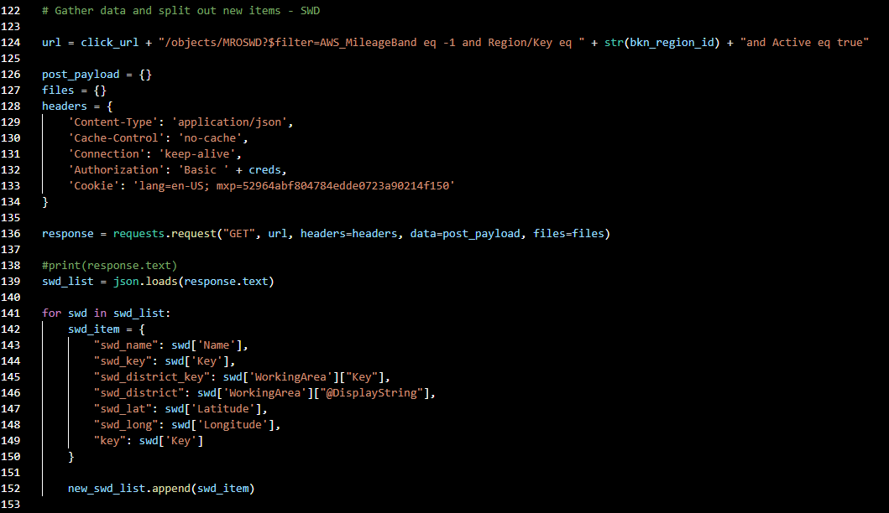

#### New Assets

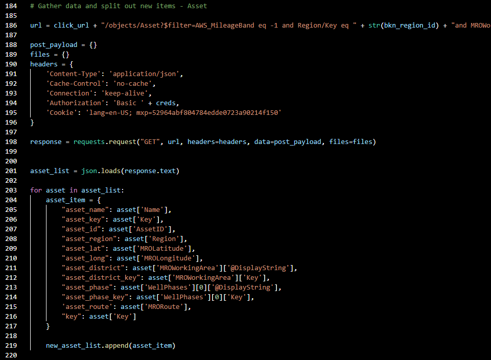

##### New Asset Example

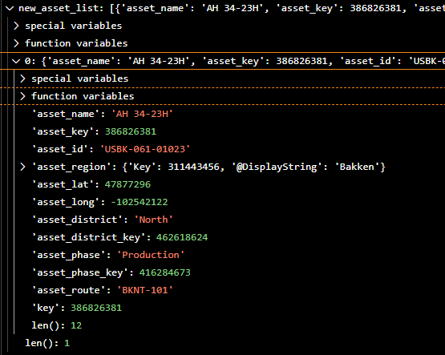

7. Generate Combinations of Bands

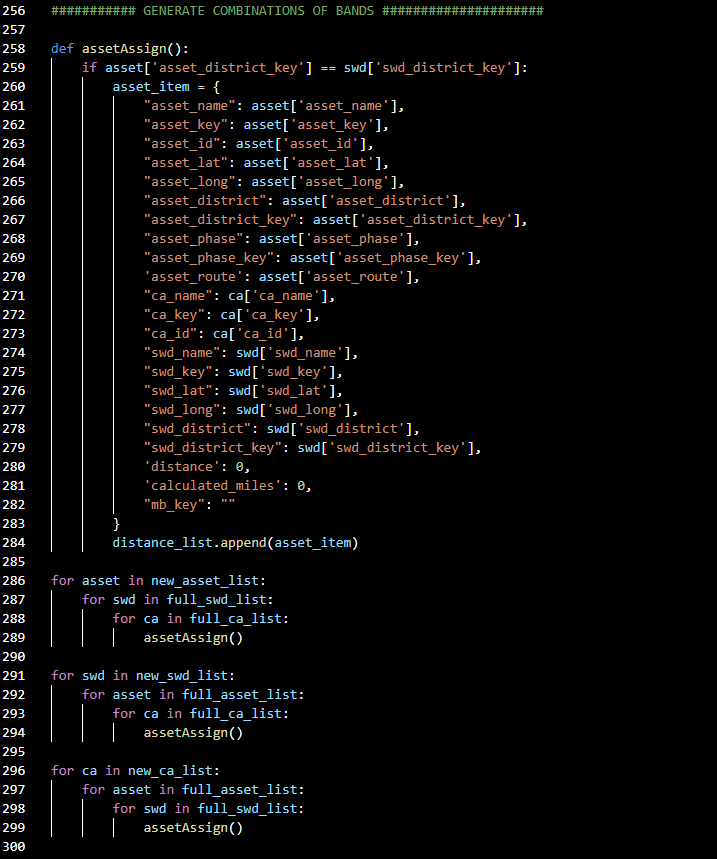

9. Calculate Distances

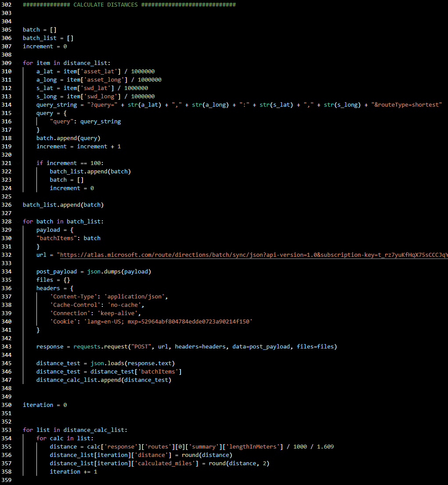

11. Get Mileage Bands
13. Assing Mileage Bands

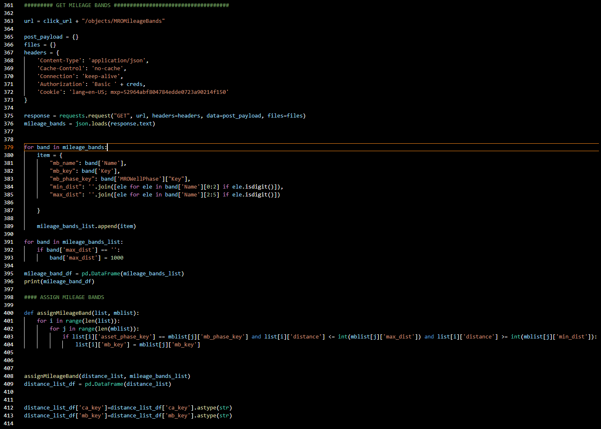

mileage band table
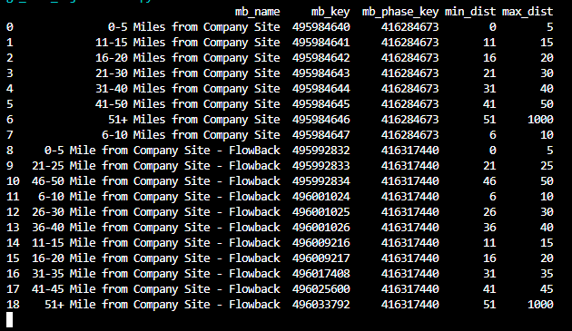

15. Get and Assign Unit Rate

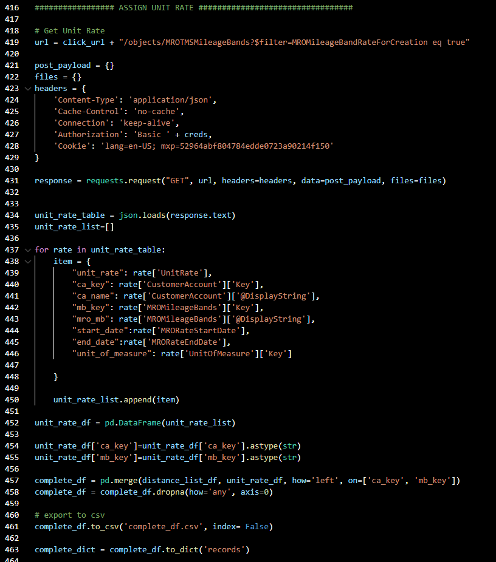

17. Export to TMSMileageBand table

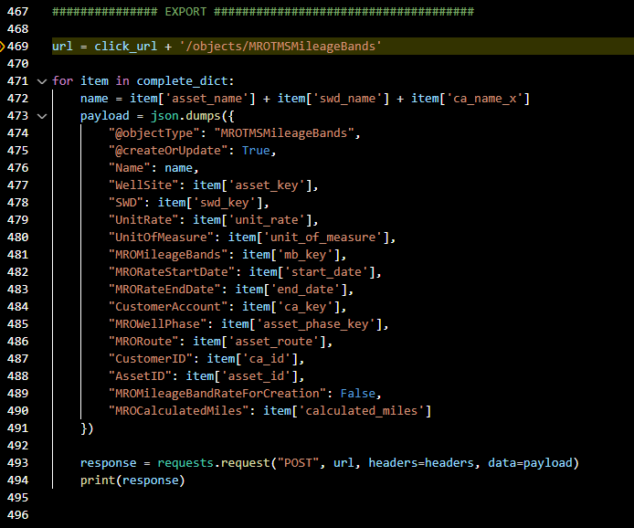

19. Change flags of new CA, Asset, and SWD to false

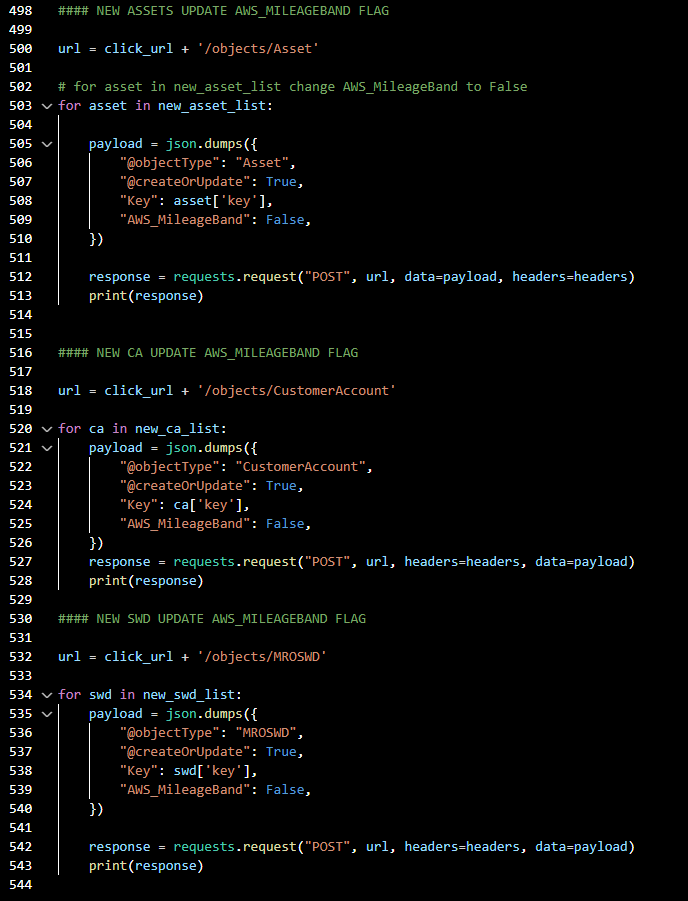
